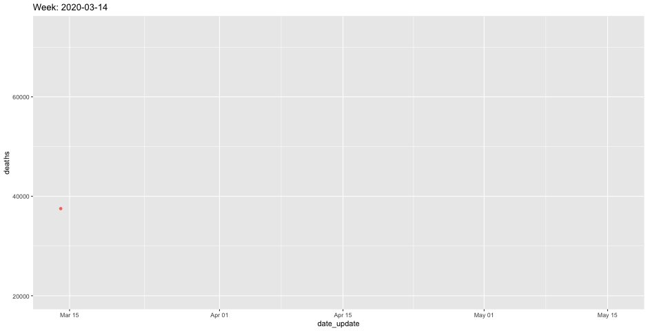

```{r setup, include=FALSE}

packages <- c("tidyverse", "lubridate", "geofacet", "knitr",
              "MMWRweek", "DT")

if (length(setdiff(packages, rownames(installed.packages()))) > 0) {
  install.packages(setdiff(packages, rownames(installed.packages())), repos = "http://cran.us.r-project.org")  
}

library(tidyverse)
library(lubridate)
library(knitr)
library(MMWRweek)
library(geofacet)
library(DT)

options(knitr.kable.NA = '')


nat <- read_csv("data/outputs/national_and_state_summary.csv") %>% 
  filter(state=="US.agg") %>% 
  rename(covid19.nchs=covid.death.hybrid)

dates <- MMWRweek(nat$week_start_date)

nat$year <- dates$MMWRyear
nat$day <- dates$MMWRday
nat$week <- dates$MMWRweek
```

# When did we pass 100k excess deaths?

```{r k100, warning=F, message=F}
nat100k <- nat %>% 
  filter(year==2020) %>% 
  filter(week>=10)

x <- 1
deaths <- 0

while (deaths <100000) {
  deaths <- deaths + nat100k$excess_all_cause_deaths[x]
  x <- x+1
}
x <- x-1

month_of <- month(nat100k$week_end_date[x], label=T)
day_of <- day(nat100k$week_end_date[x])

print(paste0("We passed 100,000 excess deaths by ", month_of, " ", day_of, ", 2020"))

```

-----

## Percent over time

```{r percent_national, warning=F, message=F, fig.height=3}
nat_latest <- nat %>% 
  filter(year==2020) %>% 
  filter(week>=10) %>% 
  mutate(percent=round(covid19.nchs/excess_all_cause_deaths*100))

nat_latest$percent <- ifelse(nat_latest$percent >100 | nat_latest$percent <0, NA, nat_latest$percent)

nat_table_percent <- nat_latest %>% 
  select(week_end_date, excess_all_cause_deaths, covid19.nchs, percent)

kable(nat_table_percent, format.args = list(big.mark = ","))

ggplot(nat_table_percent, aes(x=week_end_date, y=percent)) +
  geom_col() +
  theme_minimal() +
  labs(title="Covid-19 deaths as % of excess deaths")

mar28 <- nat_table_percent %>% 
  filter(week_end_date==ymd("2020-03-28")) %>% 
  pull(percent)

apr18 <- nat_table_percent %>% 
    filter(week_end_date==ymd("2020-04-18")) %>% 
  pull(percent)

may2 <- nat_table_percent %>% 
  filter(week_end_date==ymd("2020-05-02")) %>% 
  pull(percent)

may9 <- nat_table_percent %>% 
  filter(week_end_date==ymd("2020-05-09")) %>% 
  pull(percent)


```

As of May 2 it was `r may2` percent, compared to `r mar28` percent as of March 28 and `r apr18` percent as of April 18.

At the beginning of the pandemic, only about half of the excess deaths were attributed to covid-19. Since then, that ratio has improved to 4 out of 5.

## States

New York, Massachusetts, New Jersey, DC, Maryland, and Colorado have been better at closing the gap. 


```{r states_prep, warning=F, message=F}


states <- read_csv("data/outputs/national_and_state_summary.csv") %>% 
  filter(state!="US.agg") %>% 
  rename(covid19.nchs=covid.death.hybrid) %>% 
  filter(!is.na(week_start_date))

dates <- MMWRweek(states$week_start_date)

states$year <- dates$MMWRyear
states$day <- dates$MMWRday
states$week <- dates$MMWRweek

state_table <- states %>% 
  filter(year==2020) %>% 
  filter(week>=10) %>% 
  mutate(percent=round(covid19.nchs/excess_all_cause_deaths*100))

state_table$percent <- ifelse(state_table$percent > 100 | state_table$percent < 0, NA, state_table$percent)


```

```{r geofacet_percent, fig.width=9, fig.height=6, warning=F, message=F}
ggplot(state_table, aes(week_end_date, percent)) +
  geom_line() +
  facet_geo(~ state, grid = "us_state_grid2") +
  ylab("Covid-19 deaths as % of excess deaths") +
  labs(title="Covid-19 deaths as % of excess deaths")
```


South Carolina
30 percent (1087 excess deaths, 326 covid-19)
Started out at 11 percent and then reached a high of 63 percent at the end of April but has since declined. 
 
Arizona
40 percent (1424 excess deaths, 565 covid-19)
Peaked in mid April but declined since then. 
 
Alabama
63 percent (738 excess, 462 covid)
They did better in the second half of April and have been declining since. 
 
Missouri 
68 percent (775 excess, 526 covid) 
Seems like they're struggling. 

Florida
67 percent (2750 deaths, 1838 covid)
Same as Arizona. Closed the gap in mid April and have since been declining.
 
Georgia 
64 percent (2006 deaths, 1282 covid)
Getting better over time. Last week of data being the exception.

Wisconsin
78 percent (552 deaths, 430 covid)
Same as Arizona and Florida. Slightly improved in mid April but have been declining since.

## Covid-19 deaths as % of excess deaths

```{r state_table_percent}

state_percent <- state_table %>% 
    mutate(date=paste0(month(week_end_date, label=T), " ", day(week_end_date))) %>% 
  select(state, date, percent) %>% 
  pivot_wider(names_from="date",
              values_from="percent")

datatable(state_percent)
```


## Deaths

```{r state_table_totals}

state_totals <- state_table %>% 
    mutate(date=paste0(month(week_end_date, label=T), " ", day(week_end_date))) %>% 
  select(state, week, date=week_end_date, excess=excess_all_cause_deaths, covid19=covid19.nchs, percent) 

datatable(state_totals, filter="top")
```

## Lag in reporting nationally



```{r nat_lag, warning=F, message=F}
natlag <- read_csv("data/archive/week11_20.csv")
```

On March 14, the national provisional count for all deaths was 37,500 but a week later, 10,000 more deaths were added for that date. By May 9, nearly two months later, the count for all deaths for March 14 had been backfilled to 55,600-- a nearly 50 percent increase from what was reported at first.

On April 11, the provisional count for all deaths was 27,300 but a month later that figure was revised to 71,800, more than two and half more than what was initially reported.


## Lag by state

New York City has the least lag when reporting provisional deaths. 

After a month, these states have the most incomplete data compared to other states, according to an analysis of weekly reports starting in mid March:

Delaware,
West Virginia,
Arkansas,
Kentucky,
Rhode island,
Louisiana,
DC,
New Mexico,
Ohio,
Georgia


```{r state_lag, warning=F, message=F, fig.width=9, fig.height=12}

state_lag <- read_csv("data/archive/state_weeks_lag_long.csv") %>% 
  filter(deaths!=0)

ggplot(state_lag, aes(date_update, deaths, group=week, color=week)) +
  geom_line() +
  facet_wrap(~ sub_area, scales="free", ncol=5) +
  #scale_x_continuous(labels = function(x) paste0("'", substr(x, 3, 4))) +
  ylab("Reported provisional deaths") +
  theme_minimal() +
  theme(legend.position = "none") +
  labs(title="Reported provisional deaths over time")
```
